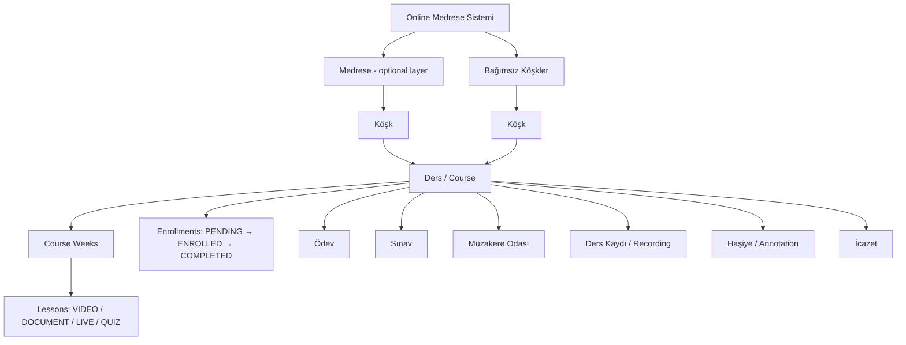
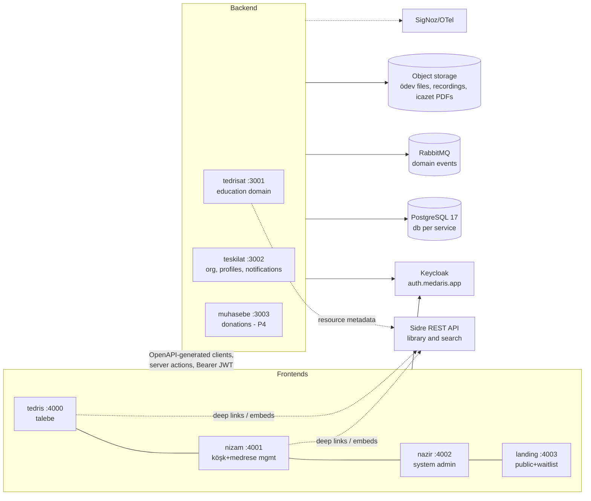

# Medaris — Online Medrese Sistemi
## Product Requirements Document & Phased Plan

| | |
|---|---|
| **Version** | 1.0 (draft for team review) |
| **Date** | 2026-07-05 |
| **Status** | Draft — to be reviewed by the core team |
| **Compiled by** | The project team, with AI-assisted synthesis of all team sources |
| **Repos** | [`amel-tech/madrasah-backend`](https://github.com/amel-tech/madrasah-backend) · [`amel-tech/madrasah-frontend`](https://github.com/amel-tech/madrasah-frontend) — planned merge into the [`amel-tech/medaris`](https://github.com/amel-tech/medaris) monorepo |
| **Owner** | **Hadis ve Siyer Medresesi** (project owner); **Amel Tech** is the bridge community, not the owner — see `docs/ecosystem-boundaries.md` |
| **Related project** | Sidre (Islamic digital library platform, separately owned by the Sidre team) — owns *Kaynaklar ve Kütüphane* and *Hakemli Yayın* (§9) |
| **Ecosystem mission** | Technological sovereignty for Muslims — the response to *Sömürü 4.0* (digital colonialism); charter: `docs/ecosystem-boundaries.md` |

**Sources synthesized:** Linear *Kapsam Dokümanları* (Özet Notlar, Amaç ve Kapsam, Eğitim Modeli–İşlev, Deneyimsel), *Yetkilendirme Uzun Vade Planı v1.0* (21 Nov 2025), *Keycloak Uyarlama Teknik Analizi* (19 Dec 2025), *Talebe & Müderris Dashboard Analizi v1.0* (22 Jan 2026), *Deckcard Analizi* (22 Jan 2026), *Course Entity Faz 1 Analiz & Tasarım v1.0*, meeting notes (Proje İskeletleri 13 Jul 2025, Backend Repo Değerlendirme 20 Jul 2025), *İlk Faz Sunucu-Servis Eşleşmesi*, *Açık Kaynak Yazılım Değerlendirme Formu*, plus a full code audit of both repos (July 2026) and the Sidre repo boundary.

---

## 1. Executive summary

**Medaris** brings the classical medrese education method — mütalaa (guided close reading), ders (lesson), müzakere (scholarly discussion), ezber (memorization), ödev (assignments), and ultimately **icazet** (chain-authorized certification) — onto an open-source online platform, so that authentic İslâmî ilimler education can reach anyone, anywhere, 7/24.

It is **not a generic LMS**. Three things differentiate it:

1. **The medrese method as a first-class product model** — mütalaa gating, müzakere-centred assessment, haşiye (annotation) culture, and icazet with public silsile (transmission chains).
2. **A federated institution model** — independent **köşks** (subject lodges) and **medreses** (institutions) run their own teaching under their own governance, on shared infrastructure ("Hadis ve Siyer Araştırmaları Medresesi'nin Hadis Köşkü", "Amel Tech Medresesi'nin Yapay Zeka Köşkü").
3. **Values-aligned open source** — community-built, with a dependency-selection policy that weighs *Müslümanların hassasiyetlerine uygunluk* at 50%.

**Where we are (July 2026):** the foundation is real and deployed to a dev environment. The `tedrisat` backend service and the `tedris`/`nizam` frontends deliver a working köşk → course → syllabus → enrollment → progress loop and a complete flashcard/ezber system. Keycloak authentication works end-to-end. The long-term authorization matrix is implemented in draft PR [#80](https://github.com/amel-tech/madrasah-backend/pull/80). Everything else in the vision — medrese layer, mütalaa, müzakere, ödev, imtihan, icazet, tasadduk, notifications, library — is designed on paper but not built.

**The plan** (§11) is five phases: **(1) Hardening & Governance** → **(2) Core Learning Loop** → **(3) Institutions & Closed Beta** → **(4) Library, İcazet, Tasadduk & Public Launch** → **(5) Frontier** (AI, Matrix, self-hosted live, blockchain icazet). Library/publication capability is consumed from **Sidre** rather than rebuilt (§9).

---

## 2. Problem, vision, goals

### 2.1 Problem

The medrese represents an unbroken educational method spanning today's primary school through professorship, rooted in the transmission from the Prophets and shaped over centuries. Access to it is constrained by geography, time, and the scarcity of qualified müderris–talebe relationships. Existing LMS platforms digitize *content delivery* but not the medrese *method*: they have no concept of mütalaa as a prerequisite, müzakere as assessment, haşiye as collaborative scholarship, or icazet as chain-authorized credentialing.

### 2.2 Vision

A platform where geleneksel medrese usulleri meet the academy in a digital environment: every talebe gets a personal mütalaa journey and active müzakere participation; every müderris can guide students closely and one-to-one; every medrese can extend its teaching to the whole ümmet without surrendering its pedagogical authority.

### 2.3 Product goals

| # | Goal | Measured by |
|---|------|-------------|
| G1 | Deliver the complete weekly medrese loop online (mütalaa → ders → müzakere → ezber → ödev) | Loop-completion rate per enrolled talebe per week |
| G2 | Let institutions self-organize (medrese → köşk → ders) with correct, granular authorization | # active köşks/medreses; zero cross-tenant authz incidents |
| G3 | Make ezber a daily habit | DAU on study mode; cards mastered/talebe/week; reminder opt-in rate |
| G4 | Establish trustworthy digital icazet with public silsile | # icazets granted under the scholarly governance process |
| G5 | Grow a sustainable OSS community around the platform | External contributors/quarter; time-to-first-review |
| G6 | Sustain operations through tasadduk (donations), not ads or data | Donation volume; cost coverage ratio |

### 2.4 Non-goals (explicitly out of scope for Medaris)

- **Hosting the book corpus / digital library** — delegated to **Sidre** (§9). Medaris links and embeds; it does not build a text platform.
- **Peer-reviewed publication (hakemli yayın) infrastructure** — delegated to **Sidre** (greenfield there; §9.3). Medaris surfaces publish/consume flows only.
- **Building our own video-conferencing stack before Phase 5** — Zoom-first, self-hosted evaluated later (§13 OQ-4).
- **Native mobile apps in Phases 1–4** — responsive web first; native/PWA decision deferred (§13 OQ-7).
- **Any economic model on the future blockchain icazet ledger** — explicitly ruled out in the scope docs.
- **General social networking** — müzakere/forums exist to serve the ders, not as a standalone network.

---

## 3. Users & personas

| Persona | Role in system | Primary needs |
|---|---|---|
| **Talebe** (student) | Enrolls in dersler; follows köşks | Clear personal journey: active courses, mütalaa schedule, daily ezber queue, ödev deadlines, progress & feedback; multi-device continuity; private study materials (private decks, personal haşiyes) |
| **Müderris** (instructor) | Assigned to dersler | Author syllabus; run mütalaa checks & live ders; assign/grade ödev; manage course decks; see per-talebe reports; plan müzakere |
| **Köşk Manager** | Owns a köşk (independent or under a medrese) | Create/manage courses, assign müderris, approve enrollments, köşk-level decks & discovery presence |
| **Medrese Nazırı** | Governs a medrese | Affiliate köşks, invite/remove nazırs, medrese-wide decks/tags, analytics, donation management; *no direct authority over individual ders* (only indirect via affiliated köşks) |
| **System Admin** | Platform operator — Medaris core team under Hadis ve Siyer Medresesi (the authz source doc says "Amel Tech ekibi"; superseded by the ownership model in `docs/ecosystem-boundaries.md`) | Full platform authority: global decks/tags, moderation, operations |
| **Guest / Anonim** | Not signed in | Discover köşks & courses; see course teaser (first N weeks); public decks; landing/waitlist |
| **Bağışçı** (donor) | Any authenticated user (or guest, TBD) | Donate to system, medrese, müderris, or talebe; get receipts |

A single Keycloak identity can hold different roles on different resources simultaneously (müderris in one ders, talebe in another). Roles are **resource-scoped, not global** — this is the central design fact of the authorization model (§7).

---

## 4. Domain model & glossary

### 4.1 Hierarchy (invariant)

Rules (from the authorization plan, confirmed against schema):
- **Every ders belongs to exactly one köşk.** A köşk *may* belong to a medrese; independent köşks are first-class (and are all that exists in code today).
- **Medrese Nazırı has no direct authority over a ders** — only indirect authority when the köşk is affiliated.
- **Flashcard decks exist at five ownership levels**: Global (system), Medrese, Köşk, Course, and **Private** (personal, attached to nothing — the privacy-critical case).

### 4.2 Glossary

| Term | Meaning | System usage |
|---|---|---|
| **Medrese / Madrasah** | Institution spanning all education levels | Planned top-level tenant (Phase 3); entity in authz matrix |
| **Köşk** | Subject "lodge/pavilion" hosting courses | Implemented; de-facto tenant today (`kosks` table) |
| **Ders** | Course | Implemented (`courses` + weeks + lessons) |
| **Talebe** | Student | Enrollment role |
| **Müderris** | Instructor/teacher | `course_muderris` listing; role in draft authz |
| **Nazır** | Medrese supervisor/governor | Planned role (Phase 3) |
| **Mütalaa** | Guided preparatory close reading | Planned module; can gate live-lesson participation |
| **Müzakere** | Scholarly discussion/disputation | Planned module; preferred assessment method |
| **Ezber** | Memorization (flashcards) | Implemented (decks/cards/progress/labels/bulk) |
| **Haşiye** | Marginal annotation on a text | Planned module (personal → shared → live-synced) |
| **İcazet(name)** | Chain-authorized teaching license | Planned (Phase 4); silsile = transmission chain |
| **Tasadduk** | Charitable giving | Planned donations module (Phase 4, `muhasebe`) |
| **Tedrisat** | Instruction/education | Backend service #1 (implemented) |
| **Teşkilat** | Organization | Backend service #2 (stub today) |
| **Muhasebe** | Accounting | Planned backend service #3 (finance/donations) |
| **Tedris / Nizam / Nazir** web | Learner / management / admin portals | tedris+nizam live; nazir stub |

---

## 5. Current state (as of 2026-07-05)

An honest baseline; the phased plan builds directly on it.

### 5.1 What works end-to-end (deployed to dev)

| Area | Detail |
|---|---|
| **Köşk** | CRUD, discovery metadata (field/level/tags/verified/featured/rating), follow/unfollow, pagination |
| **Courses** | CRUD under köşk; syllabus (weeks → lessons incl. live-session metadata: `scheduledAt`, `meetingUrl`, agenda); müderris & resource listings; DRAFT/PUBLISHED with DRAFT hidden from non-owners (404-style); category/level/language/duration |
| **Enrollment** | Enroll, optional approval workflow (PENDING → approve/reject by köşk owner), enrolled-course list, progress % updates |
| **Ezber (flashcards)** | Decks (public/private), cards (VOCABULARY / HADEETH types with front/back/meta), per-user progress (NEW/LEARNING/MASTERED), "add to my collection", explore public decks, two label systems + stats, **bulk Excel/CSV import/export** with sample template, study mode in tedris |
| **AuthN** | Keycloak OIDC end-to-end: JWKS-verified RS256 JWT on every backend endpoint; next-auth with refresh-token rotation; custom Keycloakify login/register theme deployed as JAR |
| **Frontends** | `tedris` (talebe portal, v1.9.0, most mature), `nizam` (köşk/course/deck management incl. enrollment approval, bulk ops, live-lesson editor), `landing` (waitlist page), all i18n-scaffolded (en/tr/ar via next-intl + Tolgee) |
| **Platform** | Turborepo monorepos ×2; NestJS 11 + Drizzle/Postgres 17; Next 15 + React 19 + Tailwind 4 + shadcn (`@madrasah/ui` ~26 components + design tokens); OpenAPI-generated typed client (`@madrasah/services`); OTel → SigNoz; release-please per component; conventional commits + husky; Docker/GHCR → Coolify on 3 VPSes (`*.medaris.net` / `medaris.app`) |

### 5.2 What exists only as design or stub

| Area | State |
|---|---|
| **Authorization (RBAC matrix)** | Fully designed (authz matrix v1.0 + Keycloak teknik analiz) and **implemented in draft PR #80** (~3.5k lines: `@Authz` decorator, closed-by-default `auth-matrix.ts`, DB-resolved roles, Keycloak client setup scripts, ~100 tests, fixes 4 documented security gaps in `main`) — **not merged** |
| **Teşkilat service** | Hello-world stub; no medrese entity anywhere in schema |
| **Nazir web** | create-next-app boilerplate |
| **Mütalaa, müzakere, ödev, sınav, icazet, tasadduk, haşiye, notifications, dashboards-as-designed, gamification** | Designed in scope/analysis docs; zero implementation (scopes for all of them already enumerated in the authz matrix) |
| **Live lessons** | Metadata fields + editor UI only; no runtime integration, no attendance |
| **Deck hierarchy (5 types)** | Only author-owned public/private decks exist; medrese/köşk/course deck types are schema work ahead |
| **RabbitMQ / Redis** | Provisioned in infra & config, **unused in code** |
| **Landing waitlist** | Form has no submit handler |
| **Tests** | Backend: good e2e for course/köşk (Testcontainers) but **zero flashcard tests, no domain unit tests**; Frontend: **none** |
| **RTL & dark mode** | RTL only on landing; tedris hardcodes `lang="tr"`, no `dir` handling; dark mode not wired app-wide (tokens exist) |
| **License / OSS governance** | **No LICENSE file in either repo** (legally *not* open source yet), no CONTRIBUTING.md, no CoC, no ADRs |
| **Seeding** | `db:seed` was removed; no dev seed path |
| **Ops hardening** | Auto-migrations run at app boot (env-gated); no rate limiting; no backup policy doc; plaintext credentials in a Linear doc |

### 5.3 Team & ways of working

Core contributors by commit volume (both repos): **frontend lead** (~338), **backend/infra lead & repo owner** (~185), and ~10 further contributors (~30–85 commits each, incl. a dedicated observability contributor). Non-code: **business analyst** (authz matrix, dashboards, deck analysis), **workspace admin** (Linear), **product/infrastructure sponsor**.

Process today: trunk-based development, conventional commits enforced, PR review, release-please versioning, Linear for planning (workspace `ameltech-online-madrasa`), Turkish-language design docs, community proposals via the *Açık Kaynak Yazılım Değerlendirme Formu*.

**Ownership & governance:** Medaris is owned by **Hadis ve Siyer Medresesi**. **Amel Tech** is the bridge community — it convenes contributors, holds the mission (*Müslüman teknolojik egemenliği* / the Sömürü 4.0 response) and cross-project standards, but owns no product. Sidre is a separately owned sibling project. Boundary and interaction rules live in `docs/ecosystem-boundaries.md`; contributors may flow across projects, authority does not.

---

## 6. Functional requirements by module

Requirement IDs are stable for Linear traceability. **Status**: ✅ built · 🔶 partial · 📄 designed only · ⬜ not designed. **Phase** = target phase (§11).

### M1 — Identity & Access

| ID | Requirement | Status | Phase |
|---|---|---|---|
| M1-1 | Username/password login via Keycloak (OIDC); registration with custom theme | ✅ | — |
| M1-2 | Resource-scoped RBAC per the long-term matrix: roles SYSTEM_ADMIN, MADRASAH_NAZIR, KOSK_MANAGER, MUDERRIS, TALEBE(ENROLLED/PENDING), DECK_OWNER, GUEST; ~50 scopes; **closed-by-default** (anything unlisted is denied) | 🔶 PR #80 | **P1** |
| M1-3 | Roles resolved from DB at request time (not baked into JWT), per the JWT-bloat/sync risk analysis; SYSTEM_ADMIN is the only Keycloak realm role | 🔶 PR #80 | P1 |
| M1-4 | Per-app Keycloak clients (`tedris-web`, `nizam-web`, `nazir-web`, `tedrisat-api`) with audience checks | 🔶 scripts in PR #80 | P1 |
| M1-5 | Fast multi-account switching on a shared device (family/medrese computers) | 📄 | P2 |
| M1-6 | User profile (display name, avatar, bio, preferences) owned by `teskilat`, keyed by Keycloak `sub` | ⬜ | P2 |
| M1-7 | Session security: refresh rotation (exists), forced re-auth on refresh failure (exists), rate limiting on auth-adjacent endpoints | 🔶 | P1 |
| M1-8 | Matrix protocol as additional identity/comm layer | 📄 future | P5 |

### M2 — Teşkilat: Medrese & Köşk

| ID | Requirement | Status | Phase |
|---|---|---|---|
| M2-1 | Köşk lifecycle: create/edit/delete, ownership, privacy flag, discovery metadata, follow | ✅ | — |
| M2-2 | Medrese entity: create/manage, profile, verification | 📄 | **P3** |
| M2-3 | Köşk ↔ medrese affiliation (köşk optionally binds to one medrese; nazır gains indirect authority) | 📄 | P3 |
| M2-4 | Nazır management: invite/remove nazır; multiple nazırs per medrese | 📄 | P3 |
| M2-5 | Medrese-level assets: tags, deck collections, analytics dashboard | 📄 | P3 |
| M2-6 | Resolve the documented medrese/köşk hierarchy ambiguity ("hiyerarşi karışmış, düzeltilecek") **before** implementation | 📄 | P3 gate |

### M3 — Courses & Curriculum (Ders)

| ID | Requirement | Status | Phase |
|---|---|---|---|
| M3-1 | Course under köşk with syllabus: weeks → lessons (VIDEO/DOCUMENT/LIVE/QUIZ), resources, müderris listing | ✅ | — |
| M3-2 | DRAFT/PUBLISHED lifecycle; drafts invisible to non-owners | ✅ | — |
| M3-3 | Guest **teaser access**: first `teaser_weeks` (default 3) visible to guests/pending; rest gated by enrollment (resolve the mockup-vs-logic contradiction from the Course Faz 1 doc: recommend *titles visible, content gated*) | 🔶 | P1 |
| M3-4 | Multi-müderris assignment with real user binding (`assign_muderris` scope), not just display rows | 🔶 | P2 |
| M3-5 | Course categorization for discovery (kategori, seviye, dil) + search | 🔶 | P2 |
| M3-6 | Course completion criteria definition (progress, mütalaa, ödev, imtihan mix — per-course configurable) | 📄 | P3 |

### M4 — Enrollment & Progress

| ID | Requirement | Status | Phase |
|---|---|---|---|
| M4-1 | Enroll flow with optional approval (PENDING → ENROLLED/rejected) by course authority | ✅ | — |
| M4-2 | Progress tracking per talebe (% today; upgrade to per-lesson completion events) | 🔶 | P2 |
| M4-3 | Enrollment notifications (approved/rejected/pending-reminder) | 📄 | P2 |
| M4-4 | Cohorts/dönem (start dates already on courses; term-based grouping & re-runs) | ⬜ | P3 |

### M5 — Ezber (Flashcards)

| ID | Requirement | Status | Phase |
|---|---|---|---|
| M5-1 | Decks + cards CRUD; VOCABULARY (Arabic↔translation) & HADEETH (full text ↔ fragment prompt) card types; personal collections; explore public decks; labels; bulk Excel/CSV | ✅ | — |
| M5-2 | Progress marking ("Ezberledim") with NEW/LEARNING/MASTERED states | ✅ | — |
| M5-3 | **Five-type deck hierarchy**: Global / Medrese / Köşk / Course / Private, with the visibility & management matrix from the Deckcard analysis (private decks invisible to müderris — privacy guarantee) | 📄 | **P2** (course/köşk/global) + P3 (medrese) |
| M5-4 | **Spaced repetition** ("Faz 1.5"): due-card scheduling, daily queue, study stats | 📄 | P2 |
| M5-5 | Difficulty levels on cards/decks + talebe-side filters | 📄 | P2 |
| M5-6 | Daily ezber reminder notifications, customizable by talebe and medrese | 📄 | P2 |
| M5-7 | Text-to-speech / speech-to-text ezber checks ("yazıdan sese, sesten yazıya") | 📄 | P5 (AI track) |

### M6 — Mütalaa

| ID | Requirement | Status | Phase |
|---|---|---|---|
| M6-1 | Mütalaa assignments attached to lessons/weeks (reading material + expectations) | 📄 | **P2** |
| M6-2 | Talebe requests mütalaa check (`request_mutala_check`); müderris approves (`approve_mutala`) | 📄 | P2 |
| M6-3 | Per-course rule: mütalaa approval **gates** live-lesson participation (medrese opts in) | 📄 | P2 |
| M6-4 | Mostly self-directed cadence (özyönetim) with scheduled guided sessions — calendar surface | 📄 | P3 |

### M7 — Müzakere & Community

| ID | Requirement | Status | Phase |
|---|---|---|---|
| M7-1 | Per-course discussion space (async forum v1): create/moderate discussions per matrix scopes | 📄 | **P3** |
| M7-2 | Scheduled live müzakere sessions (Zoom v1) with participation tracking (feeds icazet eligibility & raporlama) | 📄 | P3 |
| M7-3 | Müzakere as assessment: structured seviye-belirleme option preferred over written exams | 📄 | P3 |
| M7-4 | Talebe study groups / collaborative work areas | 📄 | P4 |
| M7-5 | Community-wide forums & social etkinlik spaces | 📄 | P4+ |

### M8 — Live Lessons (Canlı Ders)

| ID | Requirement | Status | Phase |
|---|---|---|---|
| M8-1 | Schedule live lessons on syllabus (fields + nizam editor exist); join link distribution respecting authz + mütalaa gate | 🔶 | **P2** |
| M8-2 | Attendance capture (v1 manual/self-report; v2 provider webhook) | 📄 | P2 |
| M8-3 | Recording attachment & gated access (`access_recording`, `share_recording`) | 📄 | P3 |
| M8-4 | Self-hosted conferencing (evaluate LiveKit/Jitsi/BBB via the OSS form — the 50% hassasiyet criterion applies squarely here) | 📄 | P5 |
| M8-5 | Live classroom extras: müderris whiteboard + haşiye broadcast synced to talebe devices | 📄 | P5 |

### M9 — Ödev (Homework)

| ID | Requirement | Status | Phase |
|---|---|---|---|
| M9-1 | Müderris assigns ödev (individual or bulk) with due dates | 📄 | **P2** |
| M9-2 | Talebe submits (text + file upload → object storage) | 📄 | P2 |
| M9-3 | Grading & feedback (`grade_homework`), gradebook view, bulk grade entry | 📄 | P2 |
| M9-4 | Deadline notifications | 📄 | P2 |

### M10 — İmtihan (Exams)

| ID | Requirement | Status | Phase |
|---|---|---|---|
| M10-1 | Question bank + QUIZ-type lesson runtime (auto-graded objective items) | 📄 | **P3** |
| M10-2 | Timed exams with manual grading for open questions (`create_exam`, `grade_exam`) | 📄 | P3 |
| M10-3 | Placement/seviye-belirleme flow as alternative to müzakere-based assessment | 📄 | P3 |

### M11 — Haşiye (Annotations)

| ID | Requirement | Status | Phase |
|---|---|---|---|
| M11-1 | Personal annotations on lesson materials; bookmarks | 📄 | **P4** |
| M11-2 | Shared/public haşiyes with per-item visibility (`add_annotation`, `share_annotation`) | 📄 | P4 |
| M11-3 | Annotations on Sidre-hosted book pages (deep-linked, stored Medaris-side or via Sidre annotations API — decision §13 OQ-6) | 📄 | P4 |
| M11-4 | Live sync: müderris annotates/draws during ders; talebe follows in real time on second device, adds own layers; e-ink/stylus input | 📄 | P5 |

### M12 — İcazet

| ID | Requirement | Status | Phase |
|---|---|---|---|
| M12-1 | Scholarly governance first: istişare with recognized Seydas to define issuance conditions (course completion, müzakere participation, müderris discretion) — **prerequisite gate** | ⬜ | P4 gate |
| M12-2 | Digitally signed icazetname (verifiable document + public verification page) granted via `grant_ijazah` | 📄 | P4 |
| M12-3 | İcazet profile per user; **public silsile** display (opt-in) | 📄 | P4 |
| M12-4 | Blockchain-anchored icazet ledger (**no economic model**) — possibly alongside/instead of Matrix | 📄 | P5 |

### M13 — Notifications

| ID | Requirement | Status | Phase |
|---|---|---|---|
| M13-1 | Notification service consuming domain events (RabbitMQ goes live): in-app + email; web push later | 📄 | **P2** |
| M13-2 | Preference center (channels, frequency, quiet hours) for talebe & medrese defaults | 📄 | P2 |
| M13-3 | Product triggers: enrollment status, ödev deadlines, live-lesson start, daily ezber nudge, müzakere schedule, icazet events | 📄 | P2→P4 |

### M14 — Dashboards & Reporting

| ID | Requirement | Status | Phase |
|---|---|---|---|
| M14-1 | Talebe dashboard per the dashboard analysis: active courses w/ progress & next mütalaa, ezber daily goal, notifications, weekly stats, recent haşiyes | 📄 | **P2** (core) |
| M14-2 | Müderris board: courses w/ enrollment & participation stats, pending ödev queue, talebe progress table/graphs, müzakere planner | 📄 | P2 (core) |
| M14-3 | Widget customization (drag-drop layout, persisted) | 📄 | P3 |
| M14-4 | Reports export (PDF/CSV) & medrese-level analytics for nazır | 📄 | P3 |

### M15 — Gamification & Teşvik

| ID | Requirement | Status | Phase |
|---|---|---|---|
| M15-1 | Points for completed dersler & müzakere participation; badges/rozetler; streaks for ezber | 📄 | **P3** |
| M15-2 | Achievement certificates (distinct from icazet — participation-level) | 📄 | P3 |

### M16 — Tasadduk (Donations) — `muhasebe` service

| ID | Requirement | Status | Phase |
|---|---|---|---|
| M16-1 | Donate to system / medrese / müderris / talebe (`donate`); receipts | 📄 | **P4** |
| M16-2 | Donation management for nazır (`manage_donations`); transparent reporting | 📄 | P4 |
| M16-3 | Provider & legal-entity selection (halal-compliant PSP, TR regulations, who legally receives funds) — **prerequisite gate** §13 OQ-5 | ⬜ | P4 gate |

### M17 — Kaynaklar & Kütüphane (Sidre integration — see §9)

| ID | Requirement | Status | Phase |
|---|---|---|---|
| M17-1 | Attach Sidre books/pages as course resources (deep links; Sidre public read API) | 📄 | **P4** |
| M17-2 | In-context reader embed or companion view for ders materials | 📄 | P4 |
| M17-3 | Search Sidre corpus from within Medaris (federated search box on course/library surfaces) | 📄 | P4 |
| M17-4 | Per-user features (personal libraries, Sidre annotations) via shared identity — requires SSO decision §13 OQ-6 | 📄 | P4/P5 |

### M18 — Hakemli Yayın (Sidre integration — see §9.3)

| ID | Requirement | Status | Phase |
|---|---|---|---|
| M18-1 | Medreses & mollas publish books/articles through a scholarly peer-review pipeline (lives in Sidre; Medaris links identities & surfaces "publish" entry points and published-work profiles) | ⬜ greenfield in Sidre | P5 |

### M19 — Landing & Growth

| ID | Requirement | Status | Phase |
|---|---|---|---|
| M19-1 | Wire the waitlist form to a real backend + double-opt-in email | 🔶 UI only | **P1** |
| M19-2 | Public köşk/course discovery pages (SEO; the planned SSR "Arz" surface can fold into landing or tedris) | 📄 | P3 |

---

## 7. Authorization model (cross-cutting)

Adopted design (authz matrix v1.0 + Keycloak teknik analiz + PR #80 implementation):

- **Authentication in Keycloak, authorization in the application.** JWT (RS256, JWKS) validated by `AuthGuard`; `AuthzGuard` then enforces a **TypeScript-typed, closed-by-default matrix** (`auth-matrix.ts`) via `@Authz(scope, resolver)` decorators with param/body/query and async DB resolvers.
- **Roles resolved from the database per request** (KOSK_MANAGER, MUDERRIS, ENROLLED, …), *not* stored in JWT claims — deliberately diverging from the original user-attribute proposal to avoid JWT bloat and sync staleness (both flagged as risks in the teknik analiz). SYSTEM_ADMIN remains the only realm-level role.
- **Granular endpoints** are a design rule: each operation gets its own route so the matrix maps 1:1 (the "endpoint seviyesinde authorization riskli" mitigation).
- The full role × scope × entity matrix for Course, FlashcardDeck (5 types), Köşk, Madrasah, Ijazah, and the "same-pattern" entities (Recording, Exam, Homework, Annotation, DiscussionRoom) is normative as written in the *Yetkilendirme Uzun Vade Planı v1.0*; new modules MUST extend the matrix before implementation.
- **Deny-by-default is a product guarantee**, not just a technical choice: private decks and personal haşiyes are invisible to *everyone* including müderris and nazır (System Admin excepted, audited).

**P1 acceptance:** PR #80 merged; every tedrisat endpoint carries `@Authz`; the four security gaps documented in `AUTHORIZATION.md` §8 verified fixed; authz denials audited/logged; e2e matrix tests green.

---

## 8. Non-functional requirements

| Category | Requirement |
|---|---|
| **Security** | OWASP-aligned; helmet/CORS (exists); **add rate limiting** (P1); authz audit logging (P1); secrets in a vault — remove live credentials from Linear docs (P1); dependency scanning (re-enable audit-ci in PR CI, CodeQL stays); periodic security review per `docs/SECURITY_AUDIT.md` |
| **Privacy & compliance** | KVKK (TR) + GDPR posture before any public user data collection (waitlist counts, P1); **minors policy** — talebe may include minors: age handling, parental consent, data minimization (P3 gate before beta); private-deck/haşiye privacy guarantees stated in ToS |
| **Values-aligned dependencies** | Every significant new dependency/service passes the *Açık Kaynak Yazılım Değerlendirme Formu* (fonksiyonellik 15%, **Müslüman hassasiyetlerine uygunluk 50%**, topluluk 5%, güvenilirlik 10%, lisans 10%, kullanılabilirlik 3%, dokümantasyon 5%, bilinirlik 2%) — applies especially to video, payments, AI providers |
| **i18n & RTL** | UI languages en/tr/ar (scaffolded); **RTL + `dir` + locale-aware `lang` in tedris/nizam/nazir** (gap today, P1); Arabic content typography already bundled (Scheherazade New, Uthmanic); content language per course |
| **Accessibility** | WCAG 2.1 AA progressively post-MVP (per Deneyimsel doc): screen-reader labels, keyboard nav, high-contrast; transcripts/subtitles for A/V arrive with the AI track (P5) but manual captions accepted earlier |
| **Design language** | Medrese aesthetic: calligraphy motifs, sade palette (reference: #1E40AF / #10B981 / #F5F5DC on white), implemented through `@madrasah/tokens`; dark mode wired app-wide (P1); mobile-first responsive (375/768/1024 breakpoints) |
| **Performance** | API p95 < 300 ms (reads) / 600 ms (writes) at beta load; LCP < 2.5 s on mid-range mobile; lazy-loaded dashboard widgets; SRS queue computation O(due), not O(all cards) |
| **Availability & ops** | Dev now → staging+prod split at P3; 99.5% beta target; daily DB backups + restore drill (P1); **migrations gated in CI/CD, not at app boot, for prod** (P1); OTel traces/logs/metrics with SigNoz alert rules (error rate, latency, queue depth) |
| **Scalability path** | Modular monolith per service now; RabbitMQ domain events from P2 (notifications first); extract services only on demonstrated need (YAGNI, per Backend Internal Architecture Rehberi: NestJS modules with N-TIER + repository-interface DIP) |
| **Multi-device experience** | Same account on many devices with near-real-time state (progress, notifications) — full realtime sync (annotations/whiteboard) is P5; design APIs event-first so replay/sync can attach later |
| **Testing bar** | P1 gate: domain unit tests for course/köşk/flashcard services; flashcard e2e; FE test harness (vitest+RTL) with critical-path coverage (auth, enroll, study); coverage thresholds in CI; Testcontainers pattern continues |

---

## 9. Sidre boundary (Kaynaklar & Kütüphane · Hakemli Yayın)

> **Governance note:** Sidre and Medaris are **separately owned** (Sidre team vs Hadis ve Siyer Medresesi; Amel Tech bridges). All integration below is therefore contract-based — published APIs, federated identity, no shared infrastructure — per `docs/ecosystem-boundaries.md`. The litmus test: if either project disappeared, the other must keep running (degraded, not down).

Sidre (`sidre-labs/sidre`) is an Islamic digital library platform: catalog of books/authors/categories, full text with translations, Elasticsearch Arabic full-text search, user libraries/annotations/reading-history, offline packages, PDF export — with a REST API (URI-versioned, OpenAPI spec served) and OIDC/JWT auth via Keycloak. Its own PRD names madrasa teachers/students as a target segment, and "Medrese Integration" (curriculum mapping, progress tracking, institutional accounts) is on its post-launch roadmap.

### 9.1 Division of responsibility

| Capability | Owner | Medaris's job |
|---|---|---|
| Book corpus, text hosting, reader, Arabic search, collections | **Sidre** (exists today) | Integrate: deep-link/embed, attach as course resources, federated search |
| Personal libraries, reading history, annotations on books | **Sidre** (exists) | Shared identity so the talebe is one person across both (§13 OQ-6) |
| **Hakemli yayın** (journal/article peer review, publication pipeline) | **Sidre** (roadmap only — *nothing built*; it has a reusable reviewer-role + content-submission workflow to build on) | Consume/link once built; surface publish entry-points and scholar publication profiles |
| Course resources metadata, which ders uses which kitap | **Medaris** | Own the mapping (`course_resources` → Sidre IDs) |
| Haşiye *in ders context* (lesson-anchored annotations) | **Medaris** | Own; may reference Sidre text coordinates |

### 9.2 Integration mechanics & known gaps

- Sidre's **read surface is public** (books, text-contents, search need no auth) → Phase 4 read-only integration has **zero blocking dependencies**.
- Per-user features require **shared identity**: today Medaris uses realm `amel-tech-dev` on `auth.medaris.app`; Sidre runs its own Keycloak. Options: shared realm, cross-realm identity brokering, or independent accounts with linking. → §13 OQ-6.
- **Sidre has no service-to-service auth** (no API keys / client-credentials) — fine for public reads and user-token flows, a gap if Medaris backend must call Sidre on its own behalf. Flag to Sidre team early.
- Contract: consume Sidre's published OpenAPI spec the same way the frontend consumes `tedrisat.json` (generated typed client).

### 9.3 Hakemli yayın reality check

Treat M18 as **greenfield in another team's roadmap** (their Phase 3 "Research Platform"). Do not schedule Medaris features that hard-depend on it before Sidre commits a timeline. The Medaris-side work (publish buttons, publication profiles, icazet-linked scholarly identity) is small and can trail Sidre's delivery by weeks, not months.

---

## 10. Architecture

### 10.1 Target service topology (end of Phase 4)

Principles (confirmed team decisions): separate BE/FE turborepo monorepos, **modular monolith** services (NestJS module = domain, N-TIER flow, repository interfaces owned by the service layer — DIP), REST + OpenAPI with generated clients, no BFF (Next server actions play that role), trunk-based, per-component release-please.

### 10.2 New infrastructure introduced by phase

| Phase | Addition | Why |
|---|---|---|
| P1 | Keycloak per-app clients; CI-gated migrations; backups; rate limiting | Authz rollout & ops hardening |
| P2 | RabbitMQ live (domain events); object storage (MinIO/S3-compatible, hassasiyet-vetted); notification workers; SRS scheduler (cron/queue) | Ödev files, notifications, ezber reminders |
| P3 | Staging + production environments (replace/augment the 3 temp VPSes); `teskilat` DB schema; Zoom API integration | Beta readiness, medrese layer |
| P4 | `muhasebe` service + PSP; digital-signature stack for icazet (e.g. PAdES) + public verification endpoint; Sidre client lib | Tasadduk & icazet |
| P5 | WebSocket/realtime gateway; self-hosted video (evaluated); Matrix homeserver (evaluated); AI pipeline (evaluated) | Live classroom sync & frontier features |

---

## 11. Phased plan

Sizing assumes the current volunteer cadence (~6–9 active contributors, part-time). Phases are scope-gated, not date-gated; indicative durations assume no major cadence change. Each phase ends with a demo + retro and a Linear milestone review.

### Phase 0 — Foundation *(done — baseline as of July 2026)*

Köşk/course/enrollment/flashcard loop live in dev; Keycloak auth; tedris+nizam apps; CI/CD to Coolify; observability; release automation. (Detail: §5.1.)

### Phase 1 — Hardening & Governance *(≈ 6–8 weeks)*

**Goal:** what exists becomes secure, correct, legally open-source, and contributable — unblocking everything after it.

| # | Workstream | Key items | Exit criteria |
|---|---|---|---|
| 1.1 | **Authorization rollout** | Land PR #80; `@Authz` on all endpoints; per-app Keycloak clients; authz audit logging; close the 4 documented `main` gaps (incl. unowned flashcard mutations) | Closed-by-default matrix enforced everywhere; matrix e2e suite green |
| 1.2 | **OSS legalization & governance** | Choose license (§13 OQ-1) + LICENSE in both repos; CONTRIBUTING.md; CoC; DCO or CLA; issue/PR templates; ADR practice; public roadmap board | Repos legally open source with a documented contribution path |
| 1.3 | **Quality bar** | Unit tests for course/köşk/flashcard services; flashcard e2e; FE vitest+RTL harness + smoke tests; coverage gates in CI; restore `db:seed` dev seeding; re-enable audit in PR CI | CI blocks on coverage & audit; a new contributor can seed and run everything locally in <30 min |
| 1.4 | **UX platform foundation** | RTL + `dir` + locale `lang` in product apps; app-wide dark mode via tokens; a11y baseline pass; teaser-access rule fixed (M3-3) | ar locale renders correctly RTL in tedris/nizam; dark mode toggle everywhere |
| 1.5 | **Ops hardening** | CI-gated prod migrations; daily backups + restore drill; rate limiting; secrets to a vault (purge from Linear); uptime alerts in SigNoz | Restore drill documented & rehearsed; no plaintext secrets in docs |
| 1.6 | **Growth plumbing** | Wire landing waitlist (M19-1) + double opt-in; minimal privacy policy (KVKK) | Waitlist collects real signups |

**Dependencies:** none external. **Risk focus:** PR #80 review capacity — timebox review; merge behind env flag if needed.

### Phase 2 — Core Learning Loop *(≈ 10–12 weeks)*

**Goal:** a talebe completes a full medrese week inside Medaris (mütalaa → canlı ders → ezber → ödev), and a müderris runs it. This is the product's heart.

| # | Workstream | Key items |
|---|---|---|
| 2.1 | **Ödev** (M9) | Entities + assign/submit/grade; file uploads → object storage; gradebook in nizam; deadline events |
| 2.2 | **Notifications** (M13) | RabbitMQ events live; in-app + email channels; preference center; triggers: enrollment, ödev, live-lesson, daily ezber nudge |
| 2.3 | **Ezber v2** (M5) | 5-type deck hierarchy (course/köşk/global now, medrese in P3) with migration of existing author decks; SRS scheduling + daily queue; difficulty levels & filters |
| 2.4 | **Mütalaa** (M6) | Lesson/week mütalaa assignments; request/approve flow; per-course live-lesson gating |
| 2.5 | **Live ders v1** (M8) | Zoom scheduling/join flow with authz + mütalaa gate; manual attendance; agenda surface (fields exist) |
| 2.6 | **Dashboards v1** (M14) | Talebe dashboard + müderris board core widgets (no drag-drop yet) per the dashboard analysis |
| 2.7 | **Identity** (M1-5/6) | `teskilat` user-profile module; multi-account fast switching |

**Exit criteria:** internal pilot köşk (Amel Tech) runs one real course for 2+ weeks using the full loop; every module authz-mapped; notification opt-out works; SRS returns correct due queues across timezones.
**Dependencies:** 1.1 (authz) hard-blocks all new modules; object storage decision (hassasiyet form) blocks 2.1.

### Phase 3 — Teşkilatlanma: Medrese layer, Müzakere, İmtihan & Closed Beta *(≈ 12–14 weeks)*

**Goal:** institutions onboard and a real pilot runs. The platform stops being "köşk-only".

| # | Workstream | Key items |
|---|---|---|
| 3.1 | **Teşkilat service build-out** (M2) | Resolve hierarchy ambiguity (M2-6) → madrasah entity, köşk affiliation, nazır invite/remove, medrese decks/tags/analytics; `teskilat.json` OpenAPI → generated FE client |
| 3.2 | **Nazir app v1 + nizam medrese views** | System-admin console (users, köşks, moderation, global decks); medrese management UX in nizam |
| 3.3 | **Müzakere** (M7) | Async course discussions with moderation; scheduled live müzakere with participation tracking |
| 3.4 | **İmtihan** (M10) | Question bank; QUIZ lesson runtime; timed exams; manual + auto grading; optional placement flow |
| 3.5 | **Gamification v1** (M15) | Points, rozetler, ezber streaks; achievement certificates |
| 3.6 | **Reporting** (M14-3/4) | Widget customization; PDF/CSV exports; nazır analytics |
| 3.7 | **Beta readiness** | Staging+prod environments; load test to pilot scale; KVKK review incl. **minors policy**; ToS/privacy; support & feedback channel; on-call-lite |
| 3.8 | **Closed beta** | Onboard pilot medrese (a pilot medrese is already identified) + selected waitlist cohort; weekly feedback loop |

**Exit criteria:** ≥1 real medrese + ≥3 köşks run complete courses for a month; zero cross-tenant authz incidents; beta NPS collected; stability SLO (99.5%) held.
**Dependencies:** Phase 2 loop complete; legal review capacity for 3.7.

### Phase 4 — Kütüphane, İcazet, Tasadduk & Public Launch *(≈ 1 quarter+)*

**Goal:** the differentiators ship and the doors open.

| # | Workstream | Key items |
|---|---|---|
| 4.1 | **Sidre library integration** (M17) | Course resources → Sidre books/pages (public read API — no blockers); reader deep-links/embed; federated search; agree identity approach (OQ-6) & request service-auth from Sidre team |
| 4.2 | **Haşiye v1–v2** (M11) | Personal annotations + bookmarks on lesson materials; shared haşiyes with visibility controls; Sidre-text anchoring |
| 4.3 | **İcazet** (M12) | Scholarly istişare → issuance rules (gate); signed icazetname + public verification; icazet profiles & opt-in silsile |
| 4.4 | **Tasadduk / `muhasebe`** (M16) | Legal entity + PSP decision (gate); donate flows to system/medrese/müderris/talebe; receipts; nazır donation management |
| 4.5 | **Public launch** | Open registration; onboarding funnel from landing; discovery/SEO pages (M19-2); launch comms; support rota |

**Exit criteria:** public signup live; first icazets granted under the governance process; donations flowing to a lawful entity; Sidre resources attached in ≥50% of active courses.
**Dependencies:** icazet istişare (external, start during P3); PSP/legal (external); Sidre availability for identity/service-auth (their team).

### Phase 5 — Frontier *(post-launch, exploratory — gate each item separately)*

- **Hakemli yayın** with Sidre once their pipeline exists (M18).
- **Self-hosted live platform** (LiveKit/Jitsi/BBB through the OSS form) replacing Zoom; live classroom with synced whiteboard + haşiye broadcast (M8-4/5, M11-4).
- **Matrix** integration (identity/chat) and/or **blockchain icazet ledger** (no economic model) (M1-8, M12-4).
- **AI track** (provider must pass hassasiyet vetting): transcripts/subtitles, ders summaries, personalized study plans, kök-harf dictionary on texts, manevî-destek signals (extra ethical review).
- **VR/AR classroom** experiments; native mobile decision.

### Cross-cutting per phase (always on)

Test coverage ratchet · dependency review via the OSS form · docs (ADRs, module READMEs replacing NestJS boilerplate) · Turkish/English doc parity for community · Linear hygiene (this PRD's modules → projects/milestones, FR IDs in issues).

---

## 12. Success metrics

| Stage | Metric | Target (initial) |
|---|---|---|
| P1 | CI coverage gate | ≥60% services touched; FE smoke suite green |
| P1 | Waitlist signups | 500 before beta |
| P2 | Internal pilot loop completion | ≥80% of enrolled complete a full week loop |
| P2 | Daily ezber actives / enrolled | ≥40%; reminder opt-in ≥60% |
| P3 | Beta institutions | ≥1 medrese, ≥3 köşks, ≥100 weekly-active talebe |
| P3 | Stability | 99.5% availability; API p95 <300 ms; zero authz cross-tenant incidents |
| P4 | Launch funnel | Waitlist→registered ≥35%; time-to-first-study <10 min |
| P4 | İcazet & tasadduk | First icazets granted; donations cover infra costs |
| Community | External (non-core) merged PRs | ≥3/quarter by end of P3 |

---

## 13. Open questions & decisions needed

| ID | Question | Recommendation | Owner / when |
|---|---|---|---|
| OQ-1 | **License** (nothing chosen — repos are not legally OSS yet). AGPL-3.0 protects against closed SaaS forks; Apache-2.0 maximizes adoption | Decide as a core-team vote in P1; AGPL-3.0 for apps + MIT/Apache for shared libs is a common split | Core team, P1 start |
| OQ-2 | **Profile data ownership** — Keycloak attributes vs `teskilat` table | `teskilat` profile table keyed by Keycloak `sub`; Keycloak stays identity-only | BE leads, before P2.7 |
| OQ-3 | **Deck migration** — mapping existing author-owned decks into the 5-type model | Existing decks become Private (isPublic=false) or Global-candidate (isPublic=true, admin-curated); course decks start empty | BE + business analyst, P2.3 design |
| OQ-4 | **Live platform trajectory** — Zoom (proprietary) sits awkwardly with the 50% hassasiyet criterion | Keep Zoom v1 behind a provider interface; schedule the OSS evaluation (LiveKit/Jitsi/BBB) in P4 so P5 swap is possible | Team + community form, P4 |
| OQ-5 | **Tasadduk legal entity & PSP** — who lawfully receives donations (dernek/vakıf/şirket)? Which halal-compliant PSP? | Start legal consultation during P3; hard gate for 4.4 | Product sponsor / Amel Tech, P3 |
| OQ-6 | **Identity across Medaris ↔ Sidre** — shared realm, brokering, or linked accounts; plus Sidre's missing service-auth | **Federate, don't centralize** (separate owners): each project keeps its realm; agree the "Amel One" claim standard + brokering; raise service-account need with Sidre now. Ecosystem-level decision OQ-A in `docs/ecosystem-boundaries.md` | Product sponsor (bridges both), P3 |
| OQ-7 | **Mobile strategy** — responsive web vs PWA vs native | PWA + push as P4 experiment; revisit native post-launch | FE leads, P4 |
| OQ-8 | **Assessment philosophy** — müzakere-based leveling vs exams: per-medrese configurability adds complexity | Ship both, configured per course (exam optional, müzakere preferred default) | Product + hocalar, P3 |
| OQ-9 | **Missing referenced docs** — PR #80 cites an "UZUN VADE PLAN" handoff doc not in repo/Linear; Course Faz 1 doc's endpoint section is empty | Collect from the business analyst; attach to Linear project | Workspace admin / product sponsor, P1 |
| OQ-10 | **Medrese/köşk hierarchy ambiguity** — the authz doc itself says the hierarchy diagram "karışmış durumda, düzeltilecek" | Resolve in a design review before 3.1 starts (this PRD's §4.1 is the proposed resolution) | Business analyst + BE leads, P3 gate |
| OQ-11 | **Data residency** — TR-only hosting today; diaspora users post-launch | Stay TR for launch (KVKK-simple); revisit CDN/edge after | Infra, P4 |

---

## 14. Risks & mitigations

| # | Risk | Likelihood / Impact | Mitigation |
|---|---|---|---|
| R1 | **Volunteer capacity & bus factor** (FE: one contributor ≈56% of commits) | High / High | P1 governance + docs lower contribution barrier; pair critical modules; module ownership map in Linear |
| R2 | **Authz complexity throttles velocity** (every feature must extend the matrix) | Med / High | Matrix is typed & test-covered (PR #80); "extend matrix first" checklist in PR template; granular-endpoint convention |
| R3 | **Scope gravity** — the vision (AI, VR, blockchain, Matrix) pulls focus from the loop | High / Med | §2.4 non-goals + phase gates; frontier items require a per-item go decision in P5 |
| R4 | **Deck-model migration breaks existing user data** | Med / Med | OQ-3 migration plan + dry-run on prod snapshot + rollback script |
| R5 | **Zoom dependence conflicts with values policy** | Med / Med | Provider interface (OQ-4); self-hosted evaluation scheduled |
| R6 | **Sidre timeline coupling** (their public launch ~Sep 2026; hakemli yayın unbuilt) | Med / Med | P4 uses only Sidre's *existing public read API*; M18 trails Sidre with no Medaris hard dependency |
| R7 | **KVKK/minors compliance gap at beta** | Med / High | 3.7 legal review is a hard beta gate; data minimization defaults |
| R8 | **Temp infra (3 small VPSes) under pilot load; boot-time auto-migrations** | Med / Med | P1 ops hardening; P3 staging/prod split + load test |
| R9 | **Secret hygiene** (live credentials sitting in Linear docs) | High / Med | P1: vault + rotation + purge docs |
| R10 | **İcazet legitimacy** — digital silsile without scholarly buy-in damages trust irreparably | Low / Very High | M12-1 istişare gate *before* any issuance ships; scholarly council sign-off, not a single advisor |
| R11 | **Thin tests → regressions as contributors scale** | High / Med | P1 quality gate; coverage ratchet per phase |

---

## 15. Traceability — Kapsam "Özet Notlar" → this PRD

| Scope item (Özet Notlar) | Module | Phase |
|---|---|---|
| Kullanıcı sistemi (username/password; later Matrix) | M1 | ✅ / P5 |
| Çoklu kullanıcı tek cihazda | M1-5 | P2 |
| Çok cihazlı anlık senkron deneyim | NFR multi-device; M11-4 | P2 → P5 |
| Ezber kartları (creation, tagging, sharing, hadis/kelime types, TTS/STT, "Ezberledim", zorluk, filters) | M5 | ✅ core / P2 / P5 (speech) |
| Bildirim sistemi (daily ezber nudges, customizable) | M13, M5-6 | P2 |
| Ders kayıtları (categorical, authorized) | M3, M8-3 | ✅ / P3 |
| Canlı dersler (Zoom → own system) | M8 | P2 / P5 |
| Müzakere sistemi (live; icazet-mandatory option) | M7 | P3 |
| Topluluk tartışması, akran öğrenimi | M7 | P3–P4 |
| Mütalaa sistemi (gating option) | M6 | P2 |
| Ödev sistemi | M9 | P2 |
| Sınav sistemi (müzakere-preferred, exam alternative) | M10, OQ-8 | P3 |
| **Hakemli yayın** | M18 → **Sidre** | P5 |
| **Kaynaklar ve kütüphane** (+ haşiye on books, basılı-kitap deneyimi, ders-senkron haşiye/whiteboard) | M17 → **Sidre**; M11 | P4 / P5 |
| Medreseler ve köşkler | M2 | ✅ köşk / P3 medrese |
| İcazet sistemi (dijital imzalı, public silsile) | M12 | P4 |
| Tasadduk sistemi | M16 | P4 |
| Yapay zeka (altyazı, özet, duygu-durum/manevî destek, kişiselleştirme, kök-harf sözlük) | P5 AI track | P5 |
| Sanal sınıf (AR/VR) | P5 | P5 |
| Blockchain (icazet; no economic model) | M12-4 | P5 |

Every "Temel Özellikler" bullet is covered; nothing was dropped — items were only *sequenced*.

---

## 16. Suggested next steps

1. **Core team review of this PRD** — 60–90 min session; resolve OQ-1 (license) and bless the phase cuts.
2. **Mirror into Linear**: one project per phase (or milestone per phase under *Online Medrese Sistemi*), issues seeded from module FR IDs.
3. **Kick off Phase 1** with PR #80 review as the first concrete item.
4. Share the PRD with Sidre's team for §9 alignment (identity + service-auth ask).

*Bu doküman topluluk tarafından tartışılmak üzere bir taslaktır — feedback via Linear or GitHub discussion.*
