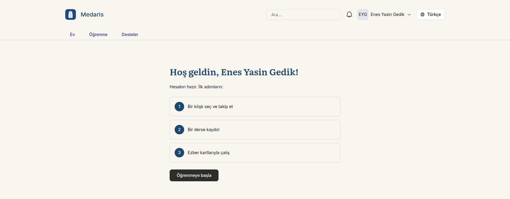

# MDRS-101 — "Kayıt ol", no English NextAuth pages, and a first-login landing

Scope is the issue's four acceptance criteria. The launch screens (A1, B1) are
not designed yet (MDRS-127), so every new screen here is a placeholder built
from `libs/ui` and the semantic token classes; **they are to be updated when the
design lands.**

## What was done

### Registration entry (AC 1)

- `@medaris/services/auth-client` gained `keycloakSignInArgs` /
  `keycloakSignIn`. Intent `register` adds `prompt=create` to the authorization
  request; `signin` does not. Both apps build their `signIn()` call through it.
- tedris header: "Giriş yap" and "Kayıt ol" side by side, labels from
  `libs/i18n` (`tedris.Auth.signIn` / `Auth.register`), no hard-coded text.
- tedris `/[locale]/auth/register`: starts the Keycloak round trip with
  `prompt=create` on arrival and ends on `/start`.
- landing: the header CTAs ("Giriş yap" also in the mobile menu), the hero CTA and the former waitlist section now
  link to `/api/tedris/<register|signin>?locale=<locale>`, a route handler that
  307-redirects to `<TEDRIS_APP_URL>/<locale>/auth/<register|signin>`. The dead
  e-mail form is gone (its section id `stay-updated` stays). `TEDRIS_APP_URL`
  is new server-side configuration: `LANDING__TEDRIS_APP_URL` in
  `.env.example`, mapped in `docker-compose.yml`, optional in `env.ts`, read
  per request — the page itself stays static. Unset, the two links answer 503.

### No English NextAuth page (AC 2)

- tedris and nizam set `pages.signIn`, `pages.signOut` and `pages.error` to
  `/auth/signin`, `/auth/signout`, `/auth/error` (`lib/auth_pages.ts`), in
  `authOptions` **and** in the middleware's `withAuth` options — `withAuth`
  does not read `authOptions`, so without the second one a signed-out visitor
  was still sent to `/api/auth/signin`.
- The three pages are app pages under `[locale]`:
  - sign-in: goes straight to Keycloak; with `?error=` it shows the error in
    the visitor's language and a retry button instead (retry never starts on
    its own, so a repeating failure cannot loop);
  - error: NextAuth's code mapped to `Auth.accessDenied`,
    `Auth.configurationError` or `Auth.errorDescription`
    (`authErrorMessageKey` in `@medaris/services/auth-client`);
  - sign-out: a localized confirmation that signs out of Keycloak too. The
    confirmation step is kept on purpose — a sign-out on a plain GET would let
    any page log the visitor out.
- The middleware's public-page list moved to `lib/public-paths.ts` and now
  includes the auth pages (behind `withAuth` the sign-in page would redirect to
  itself; NextAuth refuses an error page that needs a session). The dead
  `/api/auth/signin` entry went — the matcher never sends `/api` through the
  middleware.
- The callback the sign-in page forwards is reduced to a same-origin path
  (`destinationFromCallback` in `@medaris/utils`), so the page is not an open
  redirect.

### First login lands on B1 (AC 3)

- Every sign-in that names no page — the header buttons, landing's links, a
  bare `/auth/signin` — ends on tedris `/[locale]/start`, which redirects to
  B1 (`/[locale]/welcome`) or `/[locale]/learning`
  (`resolvePostSignInPath` in `apps/tedris/lib/post-sign-in.ts`).
- "First login" is: the `tedris.welcomed` cookie does not name this user's
  Keycloak `sub` **and** the user has no enrollment. B1's button adds the
  `sub` to the cookie (a server action; the last five users per browser) and
  opens `/learning`. Keyed by `sub`, a second account created on the same
  browser still gets B1, and signing out does not reset it; an enrolled user on
  a new device skips B1 through the enrollment count. The API has no "has seen
  onboarding" field; see follow-up.
- A sign-in the middleware started for a specific page returns to that page,
  as before.
- B1 is a placeholder: title with the user's name, three first steps, one
  button.

### nizam logo (AC 4)

- The sidebar logo linked to `/home`, whose page sat outside `[locale]` and
  never resolved. It now uses next-intl's locale-aware `Link` to `/` (the
  locale root, open to signed-out visitors too). The orphan
  `apps/nizam/app/home/page.tsx` and the unused `/home` entry in nizam's
  routing were removed.

### Test runner for the web apps

tedris-web, nizam-web and landing-web had no test runner (tedris's `test`
script echoed "Tests not implemented"). Each now has a `vitest.config.ts` that
merges the workspace base, node environment, `vitest` as a devDependency and
`vitest run` as its `test` script. `vitest.config.ts` is excluded from each
app's `tsconfig.json`: it imports the root base config, whose `vitest/config`
import does not resolve from the workspace root under `tsc`.

## What was verified

| AC | Evidence |
| -- | -- |
| 1 | `apps/landing/test/tedris-entry.spec.ts` — the CTAs' intents, the landing link, and the route's 307 to tedris's register page (plus locale fallback, 404, 503). `apps/tedris/test/registration.spec.ts` — `prompt=create` on register only, and the register page rendering `AuthEntry` with `intent: "register"`. |
| 1 | Keycloak honours `prompt=create`, measured by hand: `quay.io/keycloak/keycloak:26.3.2` (the version `keycloak-audience.e2e.spec.ts` pins) returned `kc-register-form` with it and `kc-form-login` without; the `amel-tech-dev` realm on `auth.medaris.app` served `register.ftl` with it and `login.ftl` without. **26.0.7 ignores it** (login form both ways) — see follow-up. |
| 2 | `apps/{tedris,nizam}/test/auth-pages.spec.ts` drive NextAuth's own handler: GET `signin`, `signout` and `error` all 302 to the app's pages, a failed callback ends on the app's sign-in page with the code; a control run with `pages: {}` gets NextAuth's English HTML, so the assertion can fail. The middleware itself redirects a signed-out request to `/auth/signin`. |
| 3 | `apps/tedris/test/start-page.spec.ts` — `/start` → `/tr/welcome` for a new user; B1's button sets the cookie and redirects to `/tr/learning`; the next `/start` → `/tr/learning`; a second account on the same browser still gets B1; enrolled users skip B1. `post-sign-in.spec.ts` — a callback naming no page goes through `/start`. |
| 4 | `apps/nizam/test/logo-link.spec.ts` — the logo's href has a page under `[locale]`, is public, is locale-prefixed by the middleware, and no page is left outside `[locale]`. |

`destinationFromCallback`: `libs/utils/test/callback-url.spec.ts`.

## What was not verified

- **The whole path in a browser** — landing click → Keycloak registration →
  e-mail verification → B1. Not automated: there is no browser test runner,
  and the e-mail step needs the realm's SMTP (MDRS-98). The pieces are covered
  above; the chain is a manual check.
- **Whether a user who verifies their e-mail in another browser** comes back
  signed in. Keycloak then shows its own "e-mail verified" page, and the user
  signs in again through "Giriş yap"; `/start` still sends a new user to B1
  (no cookie, no enrollment), but only by reasoning, not by test.
- **The production realm's Keycloak version.** Only the dev realm was
  measured; `prompt=create` needs a version that supports it (26.3.2 does,
  26.0.7 does not) and a realm with registration enabled (MDRS-100).
- **Rendering of the placeholder screens** (spacing, RTL) — no DOM tests.

### Observed by hand (MDRS-248, 2026-10-09)

B1 seen in production at `https://tedris.medaris.app/tr/welcome`, signed in,
Turkish: the title with the user's name, the three steps from
`tedris.WelcomePage.steps` and the "Öğrenmeye başla" button, as built above.
Still the MDRS-101 placeholder; MDRS-127 has not delivered B1 yet. Which path
led there (fresh registration or a later first sign-in) was not recorded, so
the full chain above stays unverified. RTL was not looked at.

## Follow-up

- Replace the B1, sign-in/error/sign-out placeholders and landing's CTA block
  when MDRS-127 delivers A1 and B1.
- Set `LANDING__TEDRIS_APP_URL` in each deployment (Coolify); until then the
  landing CTAs answer 503.
- `tedris.welcomed` lives in the browser (keyed by user). If "has seen B1"
  must follow the account across devices for users with no enrollment, it
  needs an API field.
- `GET /api/auth/verify-request` (e-mail provider only) still renders
  NextAuth's page; no provider here can reach it.
- Keycloak's own logout confirmation (shown when no `id_token_hint` is sent)
  is Keycloak's theme, MDRS-100's side.
